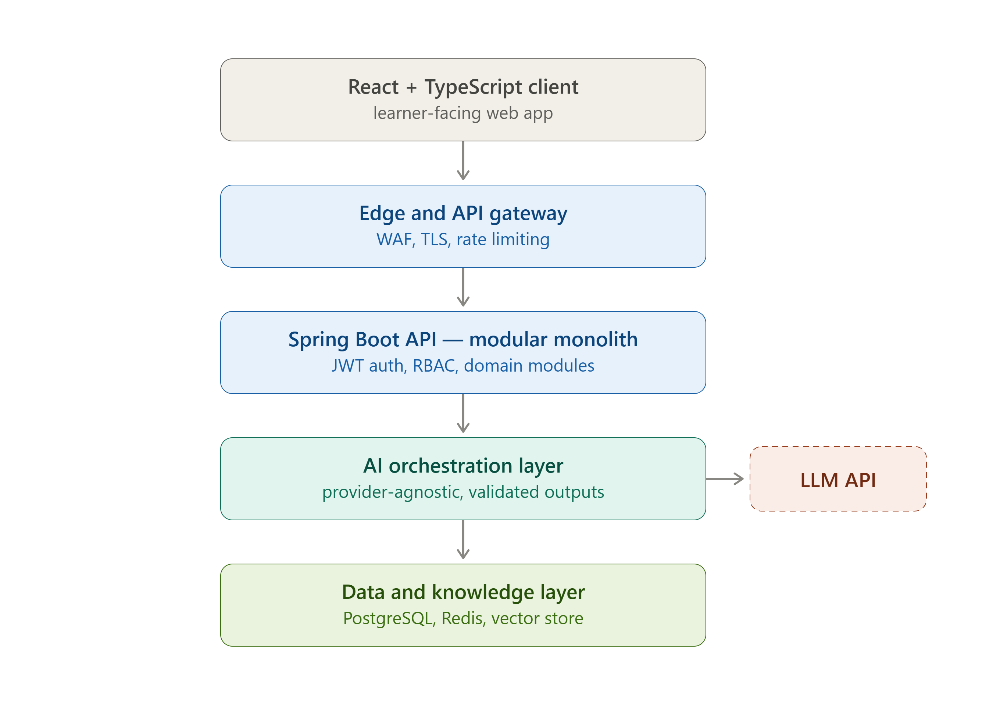

# AI-Powered Personalized Spring Boot Tutor — System Architecture

**Status:** Proposed architecture
**Initial scope:** Java + Spring Boot learning platform
**Frontend:** React + TypeScript
**Backend:** Spring Boot / Java
**Primary database:** PostgreSQL
**Cache/session support:** Redis
**Semantic memory:** Vector store
**AI:** Provider-agnostic LLM API through an AI orchestration layer
**Deployment direction:** Docker + CI/CD + AWS in later releases

> This architecture combines the supplied high-level system diagram with the project report and PRD. The database schema, API contracts, deployment controls, and security flows below are a concrete engineering design built around the domain objects and requirements defined in those sources.



---

## 1. Architecture Goals

The platform is a long-running technical tutor rather than a generic chatbot. The architecture therefore needs to support:

- personalized curriculum and roadmap generation;
- persistent learner memory outside the LLM context window;
- optional assessments and quizzes without blocking progression;
- project-based learning and code review;
- grounded AI responses using RAG;
- strong separation between learner-owned data;
- reliable progress and memory persistence;
- provider-agnostic AI integration;
- a production-oriented deployment path without introducing unnecessary microservices at the beginning.

The recommended starting point is a **modular monolith**. Domain modules stay separated inside one Spring Boot application, while microservices are deferred until a real scale or domain-boundary requirement justifies them.

---

## 2. High-Level Architecture

The supplied architecture shows the following request path:

```text
┌──────────────────────────────────────┐
│ React + TypeScript Client             │
│ Learner-facing web application       │
└──────────────────┬───────────────────┘
                   │ HTTPS
                   ▼
┌──────────────────────────────────────┐
│ Edge / API Gateway                   │
│ WAF · TLS · Rate Limiting            │
└──────────────────┬───────────────────┘
                   │
                   ▼
┌────────────────────────────────────────────────────┐
│ Spring Boot API — Modular Monolith                 │
│ JWT Auth · RBAC · Domain Modules                   │
│                                                    │
│ auth | user | learning | roadmap | assessment     │
│ quiz | project | progress | memory | ai | rag     │
│ code-review | notification                         │
└────────────────────────┬───────────────────────────┘
                         │
              ┌──────────┴───────────┐
              │                      │
              ▼                      ▼
┌────────────────────────┐  ┌─────────────────────────┐
│ AI Orchestration Layer  │  │ Data & Knowledge Layer   │
│ Provider abstraction    │  │ PostgreSQL               │
│ Context builder         │  │ Redis                    │
│ Output validation       │  │ Vector store             │
│ Retry / fallback        │  │ Object storage           │
└─────────────┬──────────┘  └────────────┬────────────┘
              │                          │
       ┌──────┴───────┐                  │
       ▼              ▼                  ▼
┌────────────┐  ┌──────────────┐  ┌──────────────┐
│ LLM API    │  │ RAG / Docs   │  │ Evaluation   │
│ Provider   │  │ Knowledge    │  │ Engine       │
└────────────┘  └──────────────┘  └──────────────┘
```

### Architectural principle

The backend owns learner state and learning logic. The LLM is an external reasoning/generation dependency, not the source of truth for learner progress.

The system stores authoritative learner state locally and retrieves only the context needed for the current interaction.

---

## 3. Component Responsibilities

### 3.1 React + TypeScript Client

Responsible for the learner-facing experience:

- onboarding;
- self-reported knowledge profile;
- optional baseline assessment;
- personalized roadmap;
- lesson and tutor interaction;
- optional quizzes;
- project workspace;
- code submission and review display;
- progress and memory views;
- settings and memory/privacy controls.

The frontend must not own authoritative learning state. It consumes the Spring Boot API and renders the persisted state returned by the backend.

### 3.2 Edge / API Gateway

The supplied target architecture places an edge/API gateway in front of the Spring Boot API. Its responsibilities are:

- TLS termination;
- WAF protection;
- request filtering;
- rate limiting;
- routing to the backend;
- protecting the application from direct public exposure where possible.

AI-heavy endpoints should receive stricter rate limits than ordinary read-only learner endpoints.

### 3.3 Spring Boot Modular Monolith

Spring Boot is the main application backend and the system-of-record coordinator.

Recommended modules:

```text
com.example.tutor
├── auth
├── user
├── learning
├── roadmap
├── assessment
├── quiz
├── project
├── progress
├── memory
├── ai
├── rag
├── code_review
└── notification
```

Each module should follow a consistent internal structure:

```text
module/
├── controller/
├── dto/
├── service/
├── domain/
├── repository/
├── mapper/
└── exception/
```

Keep controllers thin. Business rules belong in services/domain logic, persistence in repositories, and API payloads in DTOs.

### 3.4 AI Orchestration Layer

The AI layer is isolated behind an application-level abstraction rather than spreading provider-specific SDK calls throughout the domain modules.

Conceptually:

```text
AIService
├── generateExplanation()
├── generateQuiz()
├── evaluateAnswer()
├── generateRoadmap()
├── reviewCode()
├── generateHint()
└── summarizeLearningMemory()
```

The orchestration layer owns:

- prompt construction;
- retrieval of learner context;
- RAG context assembly;
- provider configuration;
- structured-output parsing;
- output validation;
- retry/fallback behavior;
- AI request tracing.

The learning domain should ask for high-level operations rather than construct raw prompts.

### 3.5 Data and Knowledge Layer

The data layer has four distinct responsibilities:

| Store | Primary purpose |
|---|---|
| PostgreSQL | Authoritative structured learner, curriculum, progress and project data |
| Redis | Cache, short-lived session/context support, rate-limit state where appropriate |
| Vector store | Semantic learner memories and/or RAG embeddings |
| Object storage | Large artifacts such as uploaded files or project assets |

Structured facts should remain authoritative in PostgreSQL. Semantic storage is a retrieval aid, not the source of truth for deterministic state.

---

## 4. Request Flow — Normal Learning Interaction

When a learner asks a question during a lesson:

```text
Learner
  │
  ▼
React Client
  │
  │ POST /api/learning/messages
  ▼
Edge / API Gateway
  │
  ▼
Spring Security
  │  authenticate + authorize
  ▼
Learning Module
  │
  ▼
AI Orchestration
  │
  ├── current roadmap/topic
  ├── structured learner state
  ├── relevant durable memory
  ├── recent session context
  └── relevant RAG documentation
  │
  ▼
Context Builder
  │
  ▼
LLM Provider
  │
  ▼
Structured / validated tutor response
  │
  ├──────────────► learner response
  │
  └──────────────► memory candidate extraction
                         │
                         ▼
                 Memory Manager
                         │
                  PostgreSQL / vector store
```

The entire historical course conversation is **not** sent to the LLM for every request. The system retrieves the relevant subset of durable context.

---

## 5. Persistent Learner Memory Architecture

Persistent memory is a core architectural differentiator.

### 5.1 Memory categories

```text
Identity / Profile
    └── target level, framework, preferences

Skill State
    └── mastery estimate, confidence, topic status

Learning History
    └── completed topics, skipped assessments, sessions

Durable Learning Memory
    └── recurring misconceptions, successful patterns,
        important preferences and decisions

Project Context
    └── current feature, design decisions, implementation history

Recent Session Context
    └── current lesson and recent conversation turns
```

### 5.2 Storage strategy

```text
                    Memory Manager
                         │
          ┌──────────────┼───────────────┐
          ▼              ▼               ▼
   Structured facts   Semantic memory   Recent context
          │              │               │
          ▼              ▼               ▼
     PostgreSQL      Vector store      Redis/session
```

A useful memory record should include timestamps and provenance where practical. Inferred memories should have confidence/evidence information, and a single mistake should not permanently define a learner without corroborating evidence.

The learner should be able to view, correct, and delete stored memories where appropriate.

### 5.3 Memory update pipeline

```text
User interaction
      ↓
Tutor response
      ↓
Memory candidate extraction
      ↓
Durability / usefulness decision
      ↓
┌─────────────┐
│ Durable?    │
└──────┬──────┘
   Yes │  No
       │   └──> discard / keep only in session context
       ▼
Persist + index
```

Do not write every chat turn into long-term memory.

---

## 6. RAG and Knowledge Architecture

The knowledge layer should use authoritative technical sources where feasible, with initial emphasis on official Spring and Java documentation.

Recommended retrieval flow:

```text
Learner Question
      ↓
Query normalization
      ↓
Embedding / keyword retrieval
      ↓
Top relevant documentation chunks
      ↓
Source metadata
      ↓
Context builder
      ↓
LLM
      ↓
Grounded explanation
```

The model abstraction should allow the provider to change without changing learning-domain logic. Possible providers mentioned in the project design include OpenAI, Gemini, Claude, or a local LLM.

---

## 7. Database Architecture

PostgreSQL is the primary transactional database.

The logical domain model contains:

```text
User
Framework
Skill
Topic
Roadmap
RoadmapItem
Assessment
Question
QuizAttempt
Answer
Project
ProjectTask
UserProgress
LearningSession
CodeSubmission
CodeReview
LearningMemory
Achievement
```

### 7.1 Entity relationship overview

```text
Framework
  │
  ├── Skill
  │     └── Topic
  │
  └── Project

User
 ├── Roadmap
 │    └── RoadmapItem ──► Topic
 │
 ├── Assessment ──► Question
 │
 ├── QuizAttempt ──► Answer ──► Question
 │
 ├── UserProgress ──► Topic / Skill
 │
 ├── LearningSession
 │
 ├── LearningMemory
 │
 └── Project ──► ProjectTask
                    │
                    └── CodeSubmission ──► CodeReview
```

### 7.2 Proposed physical schema

The exact physical schema is a proposed implementation detail; the project sources define the domain objects, while the following columns make those objects implementable in PostgreSQL.

#### `users`

| Column | Type | Key / rule |
|---|---|---|
| id | BIGSERIAL | PK |
| email | VARCHAR(255) | UNIQUE, NOT NULL |
| password_hash | VARCHAR(255) | nullable for OAuth-only accounts |
| display_name | VARCHAR(120) | NOT NULL |
| role | VARCHAR(30) | NOT NULL, default `LEARNER` |
| auth_provider | VARCHAR(30) | e.g. `LOCAL`, `GOOGLE` |
| target_level | VARCHAR(40) | nullable until onboarding |
| preferred_explanation_style | VARCHAR(40) | nullable |
| created_at | TIMESTAMPTZ | NOT NULL |
| updated_at | TIMESTAMPTZ | NOT NULL |

#### `frameworks`

| Column | Type | Key / rule |
|---|---|---|
| id | BIGSERIAL | PK |
| code | VARCHAR(50) | UNIQUE, NOT NULL |
| name | VARCHAR(120) | NOT NULL |
| description | TEXT | nullable |
| active | BOOLEAN | NOT NULL |

#### `skills`

| Column | Type | Key / rule |
|---|---|---|
| id | BIGSERIAL | PK |
| framework_id | BIGINT | FK → frameworks.id |
| name | VARCHAR(160) | NOT NULL |
| description | TEXT | nullable |
| difficulty | VARCHAR(30) | nullable |

#### `topics`

| Column | Type | Key / rule |
|---|---|---|
| id | BIGSERIAL | PK |
| skill_id | BIGINT | FK → skills.id |
| title | VARCHAR(200) | NOT NULL |
| objectives | JSONB | learning objectives |
| prerequisites | JSONB | topic dependency IDs / metadata |
| implementation_task | TEXT | nullable |

#### `roadmaps`

| Column | Type | Key / rule |
|---|---|---|
| id | UUID | PK |
| user_id | BIGINT | FK → users.id |
| framework_id | BIGINT | FK → frameworks.id |
| target_level | VARCHAR(40) | NOT NULL |
| status | VARCHAR(30) | NOT NULL |
| generated_at | TIMESTAMPTZ | NOT NULL |
| version | INTEGER | NOT NULL |

#### `roadmap_items`

| Column | Type | Key / rule |
|---|---|---|
| id | UUID | PK |
| roadmap_id | UUID | FK → roadmaps.id |
| topic_id | BIGINT | FK → topics.id |
| sequence_no | INTEGER | NOT NULL |
| status | VARCHAR(30) | locked/available/in_progress/completed/needs_review/skipped |
| optional_assessment | BOOLEAN | NOT NULL |
| project_task_id | UUID | nullable FK → project_tasks.id |
| completed_at | TIMESTAMPTZ | nullable |

#### `assessments`

| Column | Type | Key / rule |
|---|---|---|
| id | UUID | PK |
| user_id | BIGINT | FK → users.id |
| framework_id | BIGINT | FK → frameworks.id |
| status | VARCHAR(30) | NOT NULL |
| score | NUMERIC(5,2) | nullable |
| skipped | BOOLEAN | NOT NULL |
| created_at | TIMESTAMPTZ | NOT NULL |
| completed_at | TIMESTAMPTZ | nullable |

#### `questions`

| Column | Type | Key / rule |
|---|---|---|
| id | UUID | PK |
| topic_id | BIGINT | nullable FK → topics.id |
| question_type | VARCHAR(40) | MCQ, code, debugging, scenario, etc. |
| prompt | TEXT | NOT NULL |
| payload | JSONB | options / code / metadata |
| answer_key | JSONB | secured from learner API |
| difficulty | VARCHAR(30) | nullable |

#### `quiz_attempts`

| Column | Type | Key / rule |
|---|---|---|
| id | UUID | PK |
| user_id | BIGINT | FK → users.id |
| topic_id | BIGINT | FK → topics.id |
| score | NUMERIC(5,2) | nullable |
| status | VARCHAR(30) | NOT NULL |
| skipped | BOOLEAN | NOT NULL |
| started_at | TIMESTAMPTZ | NOT NULL |
| completed_at | TIMESTAMPTZ | nullable |

#### `answers`

| Column | Type | Key / rule |
|---|---|---|
| id | UUID | PK |
| quiz_attempt_id | UUID | FK → quiz_attempts.id |
| question_id | UUID | FK → questions.id |
| response | JSONB | NOT NULL |
| is_correct | BOOLEAN | nullable |
| feedback | TEXT | nullable |

#### `projects`

| Column | Type | Key / rule |
|---|---|---|
| id | UUID | PK |
| user_id | BIGINT | FK → users.id |
| project_type | VARCHAR(50) | foundation/intermediate/capstone |
| name | VARCHAR(200) | NOT NULL |
| status | VARCHAR(30) | NOT NULL |
| progress_percent | NUMERIC(5,2) | NOT NULL |
| created_at | TIMESTAMPTZ | NOT NULL |

#### `project_tasks`

| Column | Type | Key / rule |
|---|---|---|
| id | UUID | PK |
| project_id | UUID | FK → projects.id |
| topic_id | BIGINT | nullable FK → topics.id |
| title | VARCHAR(200) | NOT NULL |
| description | TEXT | nullable |
| status | VARCHAR(30) | NOT NULL |
| sequence_no | INTEGER | NOT NULL |

#### `user_progress`

| Column | Type | Key / rule |
|---|---|---|
| id | UUID | PK |
| user_id | BIGINT | FK → users.id |
| topic_id | BIGINT | FK → topics.id |
| mastery_percent | NUMERIC(5,2) | NOT NULL |
| confidence | VARCHAR(30) | low/medium/high |
| attempts | INTEGER | NOT NULL |
| evidence_count | INTEGER | NOT NULL |
| last_activity_at | TIMESTAMPTZ | NOT NULL |

#### `learning_sessions`

| Column | Type | Key / rule |
|---|---|---|
| id | UUID | PK |
| user_id | BIGINT | FK → users.id |
| roadmap_item_id | UUID | nullable FK → roadmap_items.id |
| started_at | TIMESTAMPTZ | NOT NULL |
| ended_at | TIMESTAMPTZ | nullable |
| summary | TEXT | nullable |

#### `learning_memories`

| Column | Type | Key / rule |
|---|---|---|
| id | UUID | PK |
| user_id | BIGINT | FK → users.id |
| category | VARCHAR(40) | misconception/preference/decision/etc. |
| content | TEXT | NOT NULL |
| confidence | NUMERIC(5,2) | nullable |
| evidence_count | INTEGER | NOT NULL |
| provenance | JSONB | source interaction metadata |
| vector_ref | VARCHAR(255) | nullable |
| created_at | TIMESTAMPTZ | NOT NULL |
| updated_at | TIMESTAMPTZ | NOT NULL |
| deleted_at | TIMESTAMPTZ | nullable |

#### `code_submissions`

| Column | Type | Key / rule |
|---|---|---|
| id | UUID | PK |
| project_task_id | UUID | FK → project_tasks.id |
| user_id | BIGINT | FK → users.id |
| language | VARCHAR(40) | NOT NULL |
| code | TEXT | NOT NULL |
| version_no | INTEGER | NOT NULL |
| submitted_at | TIMESTAMPTZ | NOT NULL |

#### `code_reviews`

| Column | Type | Key / rule |
|---|---|---|
| id | UUID | PK |
| submission_id | UUID | FK → code_submissions.id |
| overall_result | VARCHAR(40) | NOT NULL |
| correctness | JSONB | nullable |
| architecture | JSONB | nullable |
| security | JSONB | nullable |
| performance | JSONB | nullable |
| testing | JSONB | nullable |
| maintainability | JSONB | nullable |
| feedback | JSONB | NOT NULL |
| created_at | TIMESTAMPTZ | NOT NULL |

#### `achievements`

| Column | Type | Key / rule |
|---|---|---|
| id | UUID | PK |
| user_id | BIGINT | FK → users.id |
| code | VARCHAR(80) | NOT NULL |
| earned_at | TIMESTAMPTZ | NOT NULL |

### 7.3 Vector-store record model

The vector store is intentionally separated from the authoritative relational model.

```text
MemoryVector
├── vector_id
├── user_id
├── memory_id
├── embedding
├── category
├── content
├── topic_id (optional metadata)
└── timestamps / provenance
```

For RAG documentation embeddings, keep separate metadata for source, document version and chunk identity so stale material can be re-indexed.

### 7.4 Important indexes

Proposed indexes for the transactional store:

```text
users(email)
roadmaps(user_id, status)
roadmap_items(roadmap_id, sequence_no)
roadmap_items(roadmap_id, status)
quiz_attempts(user_id, topic_id, completed_at)
user_progress(user_id, topic_id)
learning_sessions(user_id, started_at)
learning_memories(user_id, category, deleted_at)
projects(user_id, status)
project_tasks(project_id, sequence_no)
code_submissions(user_id, project_task_id, submitted_at)
```

The exact indexes should be validated against real query plans after implementation.

---

## 8. Authentication and Authorization Architecture

The platform should support email/password authentication, OAuth2/Google login, and JWT-based authentication.

### 8.1 Authentication flow

```text
┌──────────┐
│ Browser  │
└────┬─────┘
     │ login
     ▼
┌─────────────────────┐
│ POST /api/auth/...  │
└─────────┬───────────┘
          ▼
┌─────────────────────────┐
│ Spring Security         │
│ AuthenticationManager   │
└─────────┬───────────────┘
          │
   ┌──────┴─────────┐
   │                │
   ▼                ▼
Local credentials  OAuth2 provider
   │                │
   └──────┬─────────┘
          ▼
      User identity
          │
          ▼
       JWT issued
          │
          ▼
Subsequent protected API requests
```

### 8.2 Authorization model

Every learner-owned resource must be checked against the authenticated user identity.

Examples:

```text
GET  /api/roadmaps/{id}
POST /api/projects/{id}/submissions
GET  /api/progress
GET  /api/memory
DELETE /api/memory/{id}
```

The backend must verify ownership rather than trusting a user ID sent by the client.

RBAC is appropriate for administrative functions and future instructor/admin roles. The normal learner path should enforce resource ownership even when two users have the same role.

### 8.3 Authentication responsibilities

```text
Spring Security
├── authentication
├── JWT validation
├── authorization rules
├── password hashing
├── OAuth2 login integration
└── role checks
```

Secrets, signing keys, database credentials and LLM API keys must stay outside source control.

---

## 9. API Architecture

The public interface is REST/JSON over HTTPS.

### 9.1 API boundaries

```text
/api/auth/*
/api/frameworks
/api/onboarding/*
/api/assessments/*
/api/roadmaps/*
/api/learning/*
/api/quizzes/*
/api/projects/*
/api/code-reviews/*
/api/progress
/api/memory/*
```

### 9.2 Core endpoint catalog

| Method | Endpoint | Purpose |
|---|---|---|
| POST | `/api/auth/...` | Login, registration, OAuth2-related auth operations |
| GET | `/api/frameworks` | List available learning frameworks |
| POST | `/api/onboarding/profile` | Save learner knowledge/profile data |
| POST | `/api/assessments` | Start/submit optional baseline assessment |
| GET | `/api/roadmaps/{id}` | Retrieve personalized roadmap |
| POST | `/api/learning/sessions` | Start a learning session |
| POST | `/api/learning/messages` | Send a learner tutoring message |
| POST | `/api/quizzes/{id}/attempts` | Submit an optional quiz attempt |
| POST | `/api/projects/{id}/submissions` | Submit project code |
| POST | `/api/code-reviews` | Request/store code review result |
| GET | `/api/progress` | Read learner progress |
| GET | `/api/memory` | List visible learner memories |
| DELETE | `/api/memory/{id}` | Delete a learner memory |

These endpoints follow the resource boundaries defined in the PRD; exact request and response payloads should be finalized during implementation.

### 9.3 DTO boundary

The API should expose DTOs rather than JPA entities directly.

```text
HTTP Request
   ↓
Controller DTO
   ↓
Validation
   ↓
Application Service
   ↓
Domain logic
   ↓
Repository
   ↓
Entity
```

Response DTOs should expose only fields intended for the client. Internal fields such as password hashes, answer keys, provider credentials or internal prompt metadata must never leak through API responses.

### 9.4 Standard error contract

A proposed common API error envelope:

```json
{
  "timestamp": "2026-08-19T19:00:00Z",
  "status": 400,
  "code": "VALIDATION_ERROR",
  "message": "Request validation failed",
  "path": "/api/onboarding/profile",
  "requestId": "2e1b2...",
  "details": [
    {
      "field": "targetLevel",
      "message": "must not be blank"
    }
  ]
}
```

The exact JSON shape is an implementation proposal, but the architecture should consistently provide validation, domain, authorization and infrastructure errors through one exception-handling boundary.

---

## 10. AI API Architecture

The application should not allow ordinary domain modules to call an LLM provider directly.

```text
LearningService
       │
       ▼
AI Application Contract
       │
       ▼
AI Orchestrator
       ├── context builder
       ├── prompt builder
       ├── provider selector
       ├── structured output parser
       ├── validator
       ├── retry policy
       └── fallback policy
              │
              ▼
        LLM Provider
```

### Structured AI operations

Prefer structured outputs for:

- roadmap generation;
- quiz generation;
- memory extraction;
- code review metadata.

This makes downstream validation deterministic and prevents malformed model output from directly becoming application state.

### AI failure handling

```text
LLM request
   ↓
Timeout / provider error?
 ┌──────┴───────┐
 No            Yes
 │              │
 ▼              ▼
Validate     Retry according
output       to safe policy
 │              │
 ▼              ▼
Return       Fallback / graceful
response     user-facing error
```

The AI layer should handle timeouts, invalid structured responses, retries and graceful fallback.

---

## 11. Learning and Assessment Architecture

Assessments and quizzes are optional.

```text
                Topic
                  │
        ┌─────────┴─────────┐
        ▼                   ▼
   Lesson content      Optional quiz
        │                   │
        └─────────┬─────────┘
                  ▼
          Implementation
                  │
                  ▼
           Project mapping
                  │
                  ▼
          Progress signals
```

A skipped assessment or quiz must not block the next eligible topic.

The personalization engine should use multiple signals:

```text
Optional assessment results
Optional quiz results
Implementation outcomes
Code review findings
Repeated questions / errors
Time spent
Self-reported confidence
Project milestone completion
Memory evidence
```

A missing quiz score is absence of evidence, not evidence of failure.

---

## 12. Project and Code Review Architecture

Project work is tied directly to learning topics.

```text
Roadmap Topic
     ↓
Project Requirement
     ↓
Project Task
     ↓
Learner Implementation
     ↓
Code Submission
     ↓
AI Code Review
     ↓
Feedback / Fix
     ↓
Task Completion
     ↓
Progress + Memory update
```

Code review dimensions include:

- correctness;
- architecture;
- Spring conventions;
- security;
- performance;
- testing;
- maintainability.

The tutor should prefer hints, constraints and the smallest useful correction path before supplying a complete replacement. The learner remains the implementer.

---

## 13. Caching and Session Architecture

Redis is not the authoritative learning store.

Use Redis for short-lived or high-frequency data such as:

```text
Recent session context
Frequently requested / cacheable content
Rate-limit counters
Temporary orchestration state
Short-lived job state
```

Do not use Redis as the only location for learner progress or durable memory.

Cache invalidation should be tied to explicit state changes. For example, changing a roadmap or deleting memory should invalidate affected cached context.

---

## 14. Deployment Strategy

### 14.1 Development environment

Use Docker Compose for reproducible local infrastructure:

```text
docker compose
├── react-frontend
├── spring-boot-api
├── postgresql
├── redis
└── vector-store (when enabled locally)
```

The LLM itself remains an external service unless a local model is explicitly selected.

### 14.2 Production target

The report's production direction is:

```text
Internet
   │
   ▼
Load Balancer / Edge
   │
   ▼
Spring Boot API containers
   │
   ├──────────────┬──────────────┐
   ▼              ▼              ▼
PostgreSQL      Redis       Object Storage
   │
   ▼
AI APIs
```

The supplied high-level diagram additionally places WAF, TLS and rate limiting at the edge and keeps the vector store alongside PostgreSQL/Redis.

### 14.3 AWS-oriented deployment

The project's target curriculum explicitly includes AWS fundamentals, EC2, S3, RDS, IAM and VPC basics. A practical deployment path is therefore:

```text
AWS
├── Edge / Load Balancer / WAF
├── Compute for Dockerized React + Spring Boot
├── RDS PostgreSQL
├── Redis-compatible managed cache
├── S3 object storage
├── Vector store
└── IAM / VPC / secrets configuration
```

The exact AWS compute service is an implementation choice and is not fixed by the project sources.

### 14.4 CI/CD

The supplied deployment strategy defines:

```text
GitHub
   ↓
GitHub Actions
   ↓
Build
   ↓
Tests
   ↓
Docker image
   ↓
Deployment
```

Recommended pipeline stages:

```text
Pull Request
  ├── compile
  ├── unit tests
  ├── integration tests
  ├── static / dependency checks
  └── build validation

Merge to main
  ├── build immutable Docker images
  ├── publish images
  ├── deploy staging
  └── run smoke tests

Release
  └── deploy production
```

### 14.5 Deployment environments

```text
Local → Development → Staging → Production
```

Each environment should use separate credentials and data boundaries.

### 14.6 Horizontal scaling

The Spring Boot API should be stateless at the application-node level so multiple instances can sit behind a load balancer.

```text
                 Load Balancer
               /      |      \
              ▼       ▼       ▼
           API-1    API-2    API-3
              \       |       /
               \      |      /
                  Shared state
             PostgreSQL / Redis /
                Vector Store
```

This matches the requirement that stateless application nodes should be horizontally scalable.

---

## 15. Security Architecture

Security is a first-class feature because the platform stores personal learning history, project code and AI-related credentials.

### 15.1 Edge security

```text
Internet
  ↓
WAF
  ↓
TLS
  ↓
Rate limiting
  ↓
API Gateway / Load Balancer
```

### 15.2 Application security

Use Spring Security for:

- authentication;
- JWT validation;
- authorization;
- role checks;
- resource ownership checks.

### 15.3 Data security

Protect:

- password hashes;
- JWT/signing secrets;
- OAuth credentials;
- LLM API keys;
- learner memories;
- submitted code;
- project data;
- assessment/quiz history.

Secrets must be external to source control and production configuration should come from secure environment/secret-management mechanisms.

### 15.4 Resource isolation

All user-specific objects must be scoped to the authenticated principal:

```text
User A
 ├── roadmap A
 ├── progress A
 ├── projects A
 ├── submissions A
 └── memory A

User B
 ├── roadmap B
 ├── progress B
 ├── projects B
 ├── submissions B
 └── memory B
```

A client must not be able to access User B's records by changing an ID in a URL or request payload.

### 15.5 API protection

Apply:

- input validation;
- request-size limits;
- rate limiting, especially for AI-heavy routes;
- CORS policy;
- CSRF considerations according to the chosen browser auth/session model;
- consistent authorization checks;
- audit logging for sensitive administrative actions.

### 15.6 Prompt-injection protection

User content and retrieved documents are untrusted inputs to the AI layer.

```text
Untrusted user input
        │
        ▼
Normalization / validation
        │
        ▼
Retrieval with metadata
        │
        ▼
AI context builder
        │
        ▼
LLM
```

The AI layer must avoid treating arbitrary retrieved text or user-supplied instructions as privileged application instructions.

### 15.7 Memory privacy

Memory controls are part of the product architecture, not an afterthought.

The learner should be able to:

- view retained memories;
- correct inaccurate memories;
- delete memories where supported;
- understand that memory influences personalization.

---

## 16. Observability and Operational Architecture

The PRD requires structured logs, health checks, metrics and traceable AI request IDs.

Recommended request path:

```text
Request
  │
  ├── requestId / correlationId
  ├── authenticated user id (where appropriate)
  ├── module / operation
  ├── latency
  └── outcome
```

Track at minimum:

- API latency and error rate;
- authentication failures;
- AI provider latency/timeouts;
- token/cost metrics where available;
- vector retrieval latency;
- database latency;
- Redis hit/miss ratio for applicable caches;
- queue/job failures when asynchronous processing is introduced;
- roadmap and project progress events.

Health endpoints should distinguish application health from dependency health where practical.

---

## 17. Reliability and Data Integrity

Durable learning progress and memory must not be lost after a successful persistence operation.

Use database transactions for coupled state changes, for example:

```text
Complete project task
      │
      ├── update ProjectTask
      ├── update UserProgress
      └── record learning event / memory candidate
```

The exact transaction boundary should be determined by business consistency requirements.

For AI operations, do not assume an external LLM call is transactional with PostgreSQL. Persist durable local state separately and design retries to be idempotent where possible.

### Recommended operational controls

These are implementation recommendations rather than explicit requirements in the supplied sources:

- automated PostgreSQL backups;
- tested restore procedures;
- database migration versioning;
- immutable container image versions;
- rollback support;
- re-indexing procedures for vector data;
- dependency and image vulnerability scanning.

---

## 18. Asynchronous Processing Strategy

The PRD's later production release includes async job processing. Suitable candidates are operations that do not need to block the learner's primary request:

```text
Code evaluation
Large code-review jobs
Document ingestion
Embedding generation
Knowledge-base indexing
Memory summarization
Notification delivery
Analytics aggregation
```

The synchronous path should remain focused on the interaction needed to keep the learner moving.

Later, a queue/message broker can be introduced without changing the learner-facing API contract.

---

## 19. API / Module Ownership Matrix

| Module | Owns | Main dependencies |
|---|---|---|
| auth | identity, login, tokens | Spring Security, User |
| user | learner profile/settings | PostgreSQL |
| learning | tutoring sessions/messages | AI, memory, roadmap |
| roadmap | personalized roadmap | user, topics, AI |
| assessment | baseline assessment | questions, progress |
| quiz | optional quiz attempts | questions, progress |
| project | projects/tasks/submissions | progress, code review |
| progress | mastery/confidence/state | learning signals |
| memory | durable learner memory | PostgreSQL, vector store, Redis/session |
| ai | provider abstraction/orchestration | LLM provider, RAG, memory |
| rag | technical knowledge retrieval | vector store/object storage |
| code-review | code evaluation and feedback | AI, project |
| notification | learner notifications | Redis/async infrastructure later |

---

## 20. End-to-End Example: Returning Learner

```text
1. Learner signs in
        ↓
2. JWT validated by Spring Security
        ↓
3. Dashboard requests current progress
        ↓
4. Backend loads current roadmap + project state
        ↓
5. Learner opens current topic
        ↓
6. Tutor loads:
      - current topic
      - roadmap state
      - relevant strengths/weaknesses
      - prior misconceptions
      - current project context
      - recent session context
      - relevant official documentation
        ↓
7. AI orchestrator builds compact prompt
        ↓
8. LLM generates structured response
        ↓
9. Response validated
        ↓
10. Learner receives explanation / hint / task
        ↓
11. Durable memory candidates extracted
        ↓
12. PostgreSQL/vector store updated
        ↓
13. Progress updated from the interaction
        ↓
14. Learner continues to the next action
```

This is the core mechanism that bridges the limitation of a normal long-running chat: the application preserves learner context independently of the LLM's active context window.

---

## 21. Failure Scenarios and Responses

| Failure | Expected response |
|---|---|
| LLM timeout | Retry safely, then graceful fallback/error |
| Invalid LLM structured output | Validate, retry or reject; never blindly persist |
| Vector store unavailable | Continue with structured learner state; degrade semantic retrieval where possible |
| Redis unavailable | Fall back to durable state for operations that permit it; avoid losing authoritative data |
| Database unavailable | Fail safely; do not report successful persistence |
| Quiz skipped | Continue learning; record skipped state |
| Assessment skipped | Generate roadmap using self-profile and other evidence |
| Repeated learner error | Recommend targeted review/practice |
| Stale RAG content | Track source/version metadata and re-index |
| Unauthorized resource ID | Return authorization failure; do not expose existence of another user's data |

---

## 22. Scaling Path

### Stage 1 — MVP

```text
React
  ↓
Spring Boot modular monolith
  ↓
PostgreSQL
  ↓
LLM API
```

Core features include onboarding, self-profile, optional assessment, personalized roadmap, lessons, optional quizzes, progress persistence and basic learner memory.

### Stage 2 — Guided Engineering

Add:

```text
Authentication
Project workspace
Code submissions
AI code review
Adaptive recommendations
Persistent semantic memory
Project 2
```

### Stage 3 — Grounded Mentor

Add:

```text
RAG over official documentation
Source-aware explanations
Project 3
Advanced assessments
Memory quality controls
Learning analytics
```

### Stage 4 — Production Engineering

Add:

```text
Redis
Docker
CI/CD
Cloud deployment
Observability
Security hardening
Rate limiting
Async processing
```

### Stage 5 — Advanced Platform

Introduce only where justified:

```text
Microservices
Kafka
Advanced AI workflows
System-design labs
Additional framework tracks
```

This preserves the modular-monolith-first strategy and avoids prematurely distributing the system.

---

## 23. Future Microservice Extraction Boundaries

Microservices are not required initially. If the system grows, likely extraction candidates are:

```text
Current modular monolith
        │
        ├── AI / orchestration service
        ├── Code evaluation service
        ├── Document / RAG ingestion service
        ├── Notification service
        └── Analytics / event processing service
```

The criteria for extraction should be real operational pressure such as independent scaling, resource isolation, deployment independence or asynchronous workloads—not simply the presence of many modules.

---

## 24. Architecture Decisions Summary

| Decision | Direction |
|---|---|
| Architectural style | Modular monolith first |
| Client | React + TypeScript |
| Backend | Spring Boot / Java |
| Edge | API gateway / load balancer with WAF, TLS and rate limiting |
| Auth | Spring Security + JWT; OAuth2/Google supported |
| Authorization | RBAC where needed + strict learner resource ownership |
| Primary DB | PostgreSQL |
| Cache/session | Redis |
| Semantic memory | Vector store |
| AI integration | Provider-agnostic AI orchestration layer |
| Knowledge grounding | RAG over authoritative technical documentation |
| Long-term memory | Structured PostgreSQL + semantic vector memory |
| Large files | Object storage |
| API style | REST/JSON over HTTPS |
| Deployment | Docker + CI/CD; AWS later |
| Scaling | Horizontally scalable stateless API nodes |
| Async workloads | Add queue/job processing in production phase |
| Observability | Structured logs, health checks, metrics, request IDs |
| Security | Validation, rate limiting, secret isolation, prompt-injection protection, privacy controls |

---

## 25. Security and Data-Ownership Checklist

```text
[ ] HTTPS enforced at the edge
[ ] WAF enabled in production
[ ] JWT validation implemented through Spring Security
[ ] Learner-owned resources checked server-side
[ ] Password hashes never returned in DTOs
[ ] AI API keys never exposed to the browser
[ ] Secrets excluded from Git
[ ] Request validation and size limits implemented
[ ] AI-heavy endpoints rate-limited
[ ] Prompt-injection protections applied to untrusted AI context
[ ] Sensitive admin actions audited
[ ] Memory view/correct/delete controls implemented
[ ] PostgreSQL backups configured
[ ] Restore process tested
[ ] Structured request IDs/logging enabled
[ ] AI provider failures handled gracefully
```

---

## 26. Final Architecture View

```text
                           INTERNET
                              │
                              ▼
               ┌────────────────────────────┐
               │ Edge / API Gateway         │
               │ WAF · TLS · Rate Limiting │
               └──────────────┬─────────────┘
                              │
                              ▼
               ┌────────────────────────────┐
               │ React + TypeScript Client  │
               └──────────────┬─────────────┘
                              │
                              ▼
       ┌─────────────────────────────────────────────┐
       │ Spring Boot Modular Monolith               │
       │                                             │
       │ Auth / User / Learning / Roadmap            │
       │ Assessment / Quiz / Project / Progress     │
       │ Memory / AI / RAG / Code Review            │
       └───────────────┬─────────────────────────────┘
                       │
            ┌──────────┴───────────┐
            │                      │
            ▼                      ▼
┌──────────────────────┐  ┌─────────────────────────┐
│ AI Orchestration     │  │ Data & Knowledge        │
│ Context Builder      │  │                         │
│ Prompt Builder       │  │ PostgreSQL              │
│ Provider Abstraction │  │ Redis                   │
│ Validation / Retry   │  │ Vector Store            │
└──────────┬───────────┘  │ Object Storage          │
           │              └─────────────────────────┘
     ┌─────┴──────┐
     │            │
     ▼            ▼
   LLM API      RAG / Evaluation
                  │
                  ▼
          Grounded Tutor Result
```

The central architectural idea is simple: **Spring Boot owns the learning system and durable learner state; the AI layer generates and evaluates content using compact retrieved context; PostgreSQL and the vector store preserve continuity across the entire learning journey.**

---

## Source Basis

This document is derived from and extends the following project materials supplied with the request:

- `AI_Powered_Personalized_Spring_Boot_Tutor_Report(1).md`
- `AI_Powered_Personalized_Spring_Boot_Tutor_PRD(1).docx`
- supplied high-level architecture diagram

The sources explicitly define the modular-monolith direction, React + TypeScript frontend, Spring Boot backend, PostgreSQL/Redis/vector-store architecture, AI orchestration, optional assessments/quizzes, persistent learner memory, REST resource examples, authentication/security requirements, Docker/CI/CD deployment direction, and later AWS/cloud expansion. Where this document specifies table columns, indexes, error-envelope fields, or operational controls not explicitly fixed by those materials, those parts are marked or phrased as proposed implementation details.
